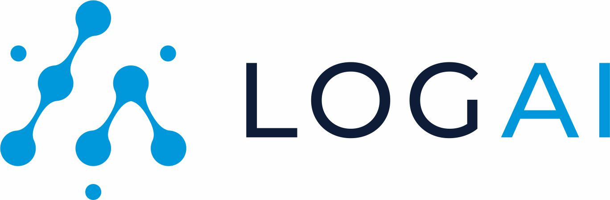

# RDK_One3B
AI-Powered Fault Detection, Prediction and Auto-Healing for Home connectivity


<p align="center">
    <br>
    
    </br>
</p>

## Table of Contents
- [RDK\_One3B](#rdk_one3b)
  - [Table of Contents](#table-of-contents)
  - [Introduction](#introduction)
- [Getting Started](#getting-started)
  - [Installation](#installation)
  - [Explore RDK\_One3B GUI Portal](#explore-rdk_one3b-gui-portal)
    - [Log Summarization](#log-summarization)
    - [Log Parsing](#log-parsing)
    - [Log Clustering](#log-clustering)
    - [Log Anomaly Detection](#log-anomaly-detection)
    - [Log Report with LLaMa](#log-report-with-llama)
  - [Reference](#reference)
  - [License](#license)

## Introduction

# Getting Started
## Installation

```shell

# Check out rdk_one3b code repo from Github
git clone https://git.yo-digital.com/hackfest6/rdk-one3b.git
cd rdk-one3b

# [Optional] Create virtual environment
python3 -m venv venv
source venv/bin/activate

# install dependencies
pip install -r requirements.txt
pip install nltk
python -m nltk.downloader punkt_tab

# make sure to add current root to PYTHONPATH
export PYTHONPATH='.'
python3 logai/gui/application.py # Run local plotly dash server.

```

Then open the RDK_One3B App via http://localhost:8050/ or http://127.0.0.1:8050/ in your browser

## Explore RDK_One3B GUI Portal

### Log Summarization


### Log Parsing


### Log Clustering


### Log Anomaly Detection


### Log Report with LLaMa


## Reference
 [Salesforce LogAI](https://github.com/salesforce/logai) A Library for Log Analytics and Intelligence
## License
[BSD 3-Clause License](LICENSE.txt)
