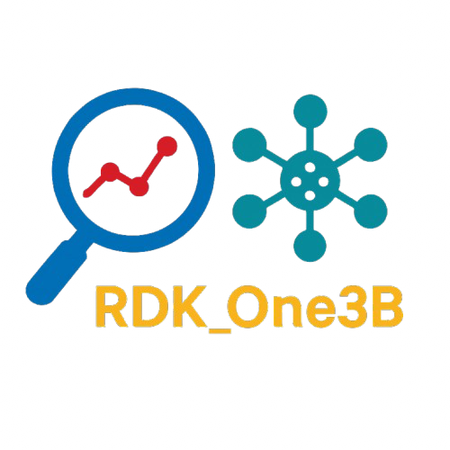
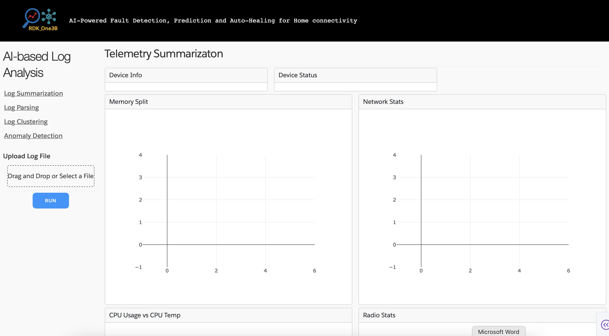
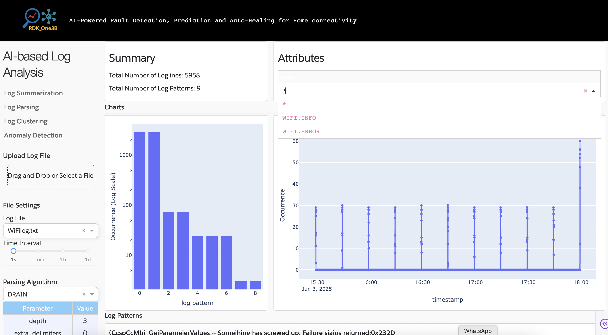
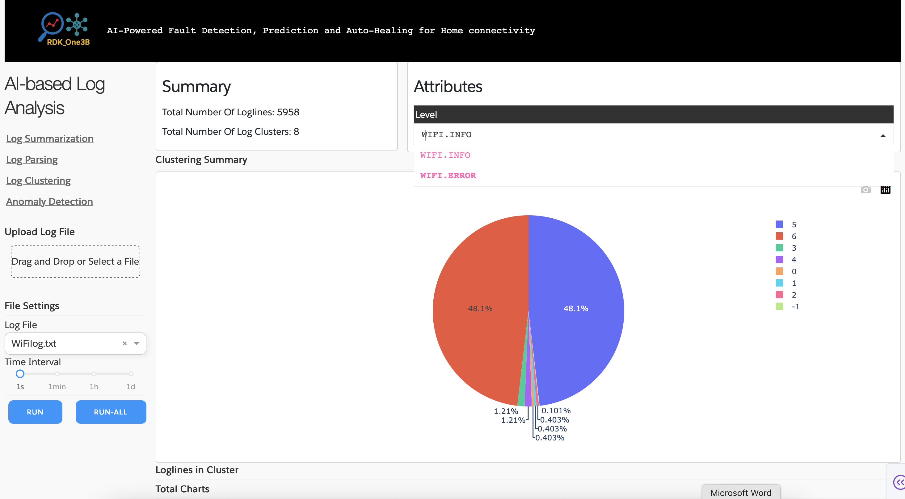
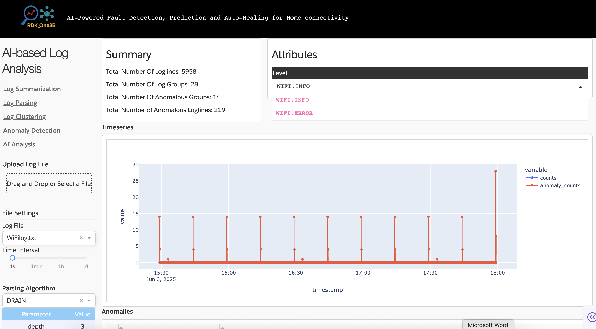

# RDK_One3B
<p align="center">
    <br>
    
    </br>
    <p align="center">
    AI-Powered Fault Detection, Prediction and Auto-Healing for Home connectivity
    </p>
</p>

## Table of Contents
- [RDK\_One3B](#rdk_one3b)
  - [Table of Contents](#table-of-contents)
  - [Introduction](#introduction)
- [Getting Started](#getting-started)
  - [Installation](#installation)
  - [Explore RDK\_One3B GUI Portal](#explore-rdk_one3b-gui-portal)
    - [Landing Page](#landing-page)
    - [Log Parsing](#log-parsing)
    - [Log Clustering](#log-clustering)
    - [Log Anomaly Detection](#log-anomaly-detection)
    - [Log Report with LLaMa](#log-report-with-llama)
    - [Dockerization](#dockerization)
  - [Reference](#reference)
  - [License](#license)

## Introduction

# Getting Started
## Installation

```shell

# Check out rdk_one3b code repo from Github
git https://github.com/Arumugam-panchatcharam/logai.git
cd logai

# [Optional] Create virtual environment
python3 -m venv venv
source venv/bin/activate

# install dependencies
pip install -r requirements.txt
pip install nltk
python -m nltk.downloader punkt_tab

# make sure to add current root to PYTHONPATH
export PYTHONPATH='.'
python3 logai/gui/application.py # Run local plotly dash server.

```

Then open the RDK_One3B App via http://localhost:8050/ or http://127.0.0.1:8050/ in your browser

## Explore RDK_One3B GUI Portal

### Landing Page
We use the various values obtained through telemetry, such as `SSID.Status`, `Radio.Status`, etc., to summarise what state the device has been in the last few hours as per the logs obtained.


### Log Parsing
**Drain3** uses a tree-based algorithm to extract structured **log templates** from raw log messages. This reduces high-cardinality logs into generalized patterns. After parsing, the logs are transformed into a feature-rich format using template frequency, token-level statistics, temporal features and metadata (e.g., source, severity, etc.). This prepares the data for classification and clustering algorithms.    

We parse the various logs present under rdklogs with the help of drain3 to see what logs have been occurring the most frequently in the last few hours on the device. It is done on a single file basis here.


### Log Clustering
**TensorFlow Decision Forests** (TF-DF) is used to train a supervised model on labeled logs. It's a scalable, interpretable tree-based model ideal for classifying logs into categories like `INFO`, `ERROR`, `SECURITY_ALERT` and detecting known failure types or operational events
 
We form clusters for the various logs present under rdklogs with the help of drain3 to see what log patterns have been occurring the most frequently in the last few hours on the device. It is done on both a single file and multi file basis here.


### Log Anomaly Detection
After parsing, the logs are transformed into a feature-rich format using template frequency, token-level statistics, temporal features and metadata (e.g., source, severity, etc.). This prepares the data for classification and clustering algorithms.



### Log Report with LLaMa
Using LLaMA (a large language model), the pipeline generates natural language **summaries** of anomaly clusters, **explanations** of complex or unknown logs and AI-powered insights for DevOps or security teams

### Dockerization
Build & Run the docker image
```shell
#Run in Detached mode
docker-compose up --build -d 

#Stop the Docker container
docker-compose down
```
Add Systemctl service

```shell
# copy the service file
sudo cp rdk-logai.service /etc/systemd/system/rdk-logai.service

# Reload systemd
sudo systemctl daemon-reload

# Enable service at boot
sudo systemctl enable rdk-logai

# Start manually now
sudo systemctl start rdk-logai

# Check logs
journalctl -u rdk-logai -f
```

## Reference
 [Salesforce LogAI](https://github.com/salesforce/logai) A Library for Log Analytics and Intelligence
## License
[BSD 3-Clause License](LICENSE.txt)
